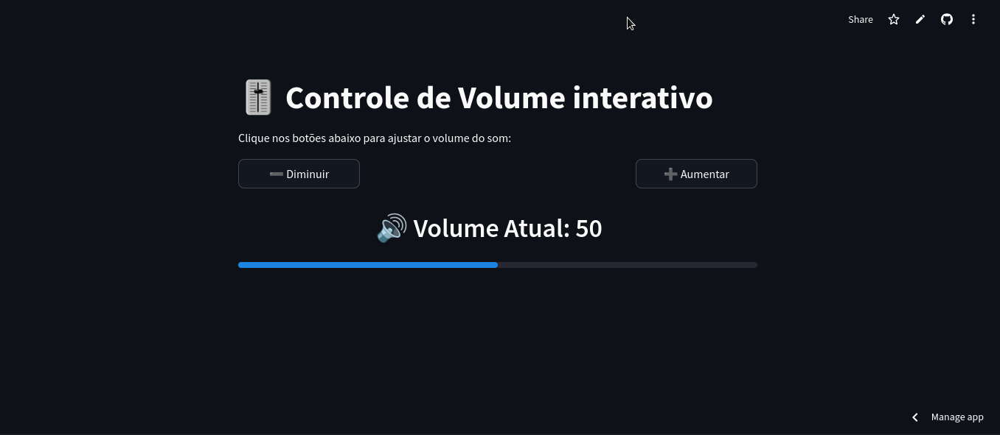

<!-- Improved compatibility of back to top link: See: https://github.com/othneildrew/Best-README-Template/pull/73 -->
<a name="top"></a>
<!--
*** Thanks for checking out the Best-README-Template. If you have a suggestion
*** that would make this better, please fork the repo and create a pull request
*** or simply open an issue with the tag "enhancement".
*** Don't forget to give the project a star!
*** Thanks again! Now go create something AMAZING! :D
-->


<!-- PROJECT SHIELDS -->
<!--
*** I'm using markdown "reference style" links for readability.
*** Reference links are enclosed in brackets [ ] instead of parentheses ( ).
*** See the bottom of this document for the declaration of the reference variables
*** for contributors-url, forks-url, etc. This is an optional, concise syntax you may use.
*** https://www.markdownguide.org/basic-syntax/#reference-style-links
-->
[![Contributors][contributors-shield]][contributors-url]
[![Forks][forks-shield]][forks-url]
[![Stargazers][stars-shield]][stars-url]
[![Issues][issues-shield]][issues-url]
[![MIT License][license-shield]][license-url]
[![LinkedIn][linkedin-shield]][linkedin-url]


<!-- PROJECT LOGO -->
<br/>
<h3 align="center">botao volume inovador</h3>

  <p align="center">
    <br/>
    <br />
    <a href="https://heitorlouzeirorepositoryifpi-botao-volume-i-botao-volume-2zzcpq.streamlit.app/">Deploy</a>
    ·
    <a href="https://github.com/HeitorLouzeiroRepositoryIFPI/botao-volume-inovador/issues">Report Bug</a>
    ·
    <a href="https://github.com/HeitorLouzeiroRepositoryIFPI/botao-volume-inovador/issues">Request Feature</a>
  </p>
</div>


<!-- TABLE OF CONTENTS -->
<details>
  <summary>Table of Contents</summary>
  <ol>
    <li>
      <a href="#about-the-project">About The Project</a>
      <ul>
        <li><a href="#built-with">Built With</a></li>
      </ul>
    </li>
    <li><a href="#usage">Usage</a></li>
    <li>
      <a href="#getting-started">Getting Started</a>
      <ul>
        <li><a href="#prerequisites">Prerequisites</a></li>
        <li><a href="#installation">Installation</a></li>
      </ul>
    </li>
    <li><a href="#roadmap">Roadmap</a></li>
    <li><a href="#contributing">Contributing</a></li>
    <li><a href="#collaborators">Collaborators</a></li>
    <li><a href="#license">License</a></li>
    <li><a href="#contact">Contact</a></li>
    <li><a href="#acknowledgments">Acknowledgments</a></li>
  </ol>
</details>


<!-- ABOUT THE PROJECT -->
## About The Project

This project is an interactive volume control application developed with Streamlit. The application allows users to increase or decrease the volume via buttons on the interface. The volume state pauses during the user session, providing a seamless and intuitive experience.

* [Openai](https://platform.openai.com/)

<p align="right">(<a href="#top">back to top</a>)</p>


### Built With

* [![Python][Python]][Python-url]

<p align="right">(<a href="#top">back to top</a>)</p>

<!-- USAGE EXAMPLES -->
## Usage
  ### 1.Home Page. 
<p align="center">
    
    <br/>
</p>


<p align="right">(<a href="#top">back to top</a>)</p>

### Prerequisites

* [Python](https://www.python.org/)
* [Streamlit](https://streamlit.io/)

<!-- GETTING STARTED -->
## Getting Started
### Installation

1. Clone the repo
   ```sh
   git clone https://github.com/HeitorLouzeiroRepositoryIFPI/botao-volume-inovador.git
   ```
2. Access the project folder in terminal/cmd
   ```sh
   cd botao-volume-inovador
   ```
3. Create a virtualenv with Python 3.9.0.
   ```sh
   python -m venv venv
   ```
4. Activate virtualenv.
    * Ubunto
    ```sh
    source venv/bin/activate
    ```

    * MacOs
    ```sh
    source venv/bin/activate
    ```

    * Windows 
    ```sh
     venv\scripts\activate
    ```

5. Install as dependencies.
    ```sh
     pip install -r requirements.txt
    ```
    
10. Run the application.
    ```sh
     streamlit run botao_volume.py 
    ```

<p align="right">(<a href="#top">back to top</a>)</p>


<!-- ROADMAP -->
## Roadmap
  - [x] Home Page.

See the [open issues](https://github.com/HeitorLouzeiroRepositoryIFPI/botao-volume-inovador/issues) for a full list of proposed features (and known issues).

<p align="right">(<a href="#top">back to top</a>)</p>

<!-- CONTRIBUTING -->
## Contributing

Contributions are what make the open source community such an amazing place to learn, inspire, and create. Any contributions you make are **greatly appreciated**.

If you have a suggestion that would make this better, please fork the repo and create a pull request. You can also simply open an issue with the tag "enhancement".
Don't forget to give the project a star! Thanks again!

1. Fork the Project
2. Create your Feature Branch (`git checkout -b feature/Improvements`)
3. Commit your Changes (`git commit -m 'Add my new Enhancements'`)
4. Push to the Branch (`git push origin feature/Improvements`)
5. Open a Pull Request

<p align="right">(<a href="#top">back to top</a>)</p>

## Collaborators

We thank the following people who contributed to this project:

<table>
  <tr>
    <td align="center">
      <a href="#">
        <br>
        <sub>
          <b>Heitor Louzeiro</b>
        </sub>
      </a>      
    </td>
  </tr>
</table>

<p align="right">(<a href="#top">back to top</a>)</p>


<!-- LICENSE -->
## License

Distributed under the MIT License. See [LICENSE](LICENSE) for more information.

<p align="right">(<a href="#top">back to top</a>)</p>


<!-- CONTACT -->
## Contact

<div align='center'>  
  <a href="https://www.instagram.com/HeitorLouzeiroRepositoryIFPI/" target="_blank">
    
  </a> 
  <a href = "mailto:HeitorLouzeiroRepositoryIFPIdev@gmail.com">
        
  </a>
  <a href="https://www.linkedin.com/in/heitor-louzeiro/" target="_blank">
    
  </a> 
</div>

Project Link: [https://github.com/HeitorLouzeiroRepositoryIFPI/botao-volume-inovador](https://github.com/HeitorLouzeiroRepositoryIFPI/botao-volume-inovador)

<p align="right">(<a href="#top">back to top</a>)</p>


<!-- MARKDOWN LINKS & IMAGES -->
<!-- https://www.markdownguide.org/basic-syntax/#reference-style-links -->
[contributors-shield]: https://img.shields.io/github/contributors/HeitorLouzeiroRepositoryIFPI/botao-volume-inovador.svg?style=for-the-badge
[contributors-url]: https://github.com/HeitorLouzeiroRepositoryIFPI/botao-volume-inovador/graphs/contributors
[forks-shield]: https://img.shields.io/github/forks/HeitorLouzeiroRepositoryIFPI/botao-volume-inovador.svg?style=for-the-badge
[forks-url]: https://github.com/HeitorLouzeiroRepositoryIFPI/botao-volume-inovador/network/members
[stars-shield]: https://img.shields.io/github/stars/HeitorLouzeiroRepositoryIFPI/botao-volume-inovador.svg?style=for-the-badge
[stars-url]: https://github.com/HeitorLouzeiroRepositoryIFPI/botao-volume-inovador/stargazers
[issues-shield]: https://img.shields.io/github/issues/HeitorLouzeiroRepositoryIFPI/botao-volume-inovador.svg?style=for-the-badge
[issues-url]: https://github.com/HeitorLouzeiroRepositoryIFPI/botao-volume-inovador/issues
[license-shield]: https://img.shields.io/github/license/HeitorLouzeiroRepositoryIFPI/botao-volume-inovador.svg?style=for-the-badge
[license-url]: https://github.com/HeitorLouzeiroRepositoryIFPI/botao-volume-inovador/blob/master/LICENSE
[linkedin-shield]: https://img.shields.io/badge/-LinkedIn-black.svg?style=for-the-badge&logo=linkedin&colorB=555
[linkedin-url]: https://linkedin.com/in/heitor-louzeiro

[Python]: https://img.shields.io/badge/Python-14354C?style=for-the-badge&logo=python&logoColor=white
[Python-url]: https://www.python.org/